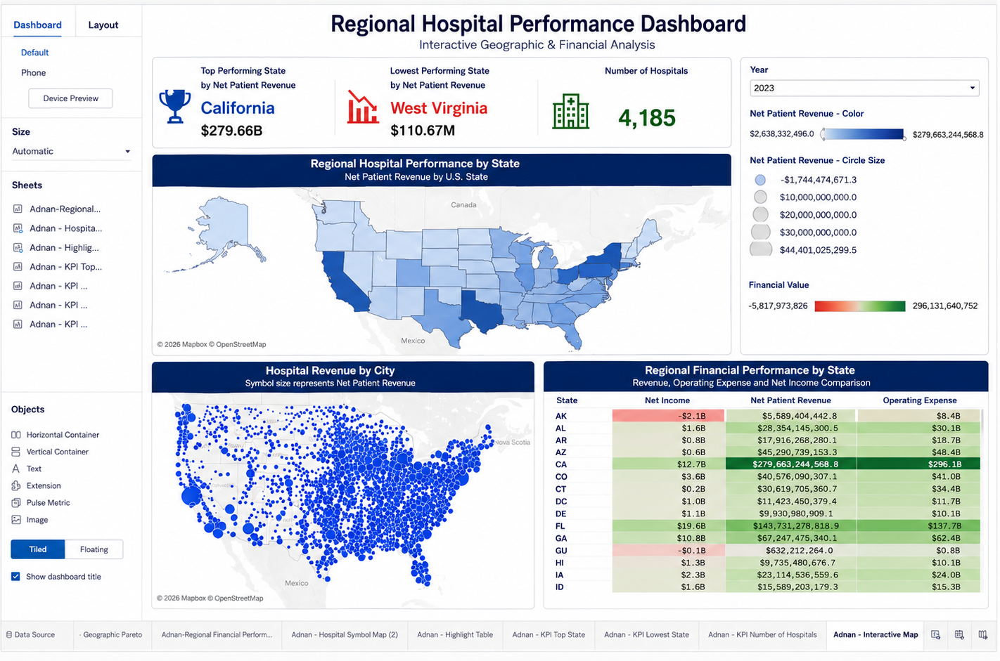
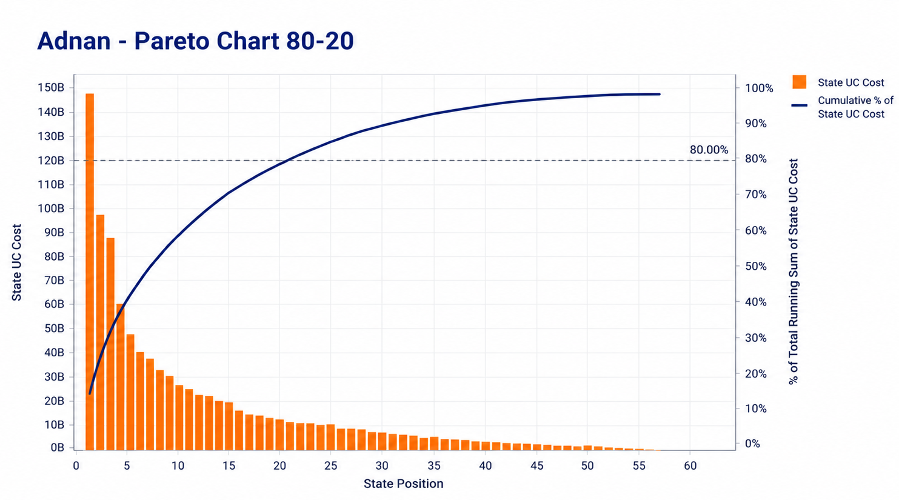

# U.S. Hospital Financial & Operational Performance Analysis

A group data visualization project analyzing the financial and operational performance of U.S. hospitals using CMS Healthcare Cost Report Information System (HCRIS) data from 2010–2024.

The project was completed as part of the Applied A.I. Solutions Development program at George Brown Polytechnic.

## Project Overview

This project uses hospital cost-report data to examine financial performance, operational efficiency, uncompensated-care costs, staffing, capacity utilization, and differences across U.S. hospitals.

The analysis combines Tableau visualization with advanced analytical techniques including regression, Pareto analysis, clustering, rolling averages, and Python/TabPy-based anomaly detection.

## Dataset

**Source:** CMS Healthcare Cost Report Information System (HCRIS)

- Period: 2010–2024
- Raw records: 120,238 hospital-year records
- Hospitals: 4,762
- States and territories: 56
- Variables: 32
- Areas analyzed: revenue, expenses, margins, uncompensated care, beds, occupancy, staffing, and utilization

The full dataset is not included in this repository because of file-size limitations.

Official CMS source:
https://www.cms.gov/data-research/statistics-trends-and-reports/cost-reports

## Tableau Dashboard

The Tableau dashboard provides an interactive geographic and financial analysis of hospital performance.

It includes:

- Top-performing state by Net Patient Revenue
- Lowest-performing state by Net Patient Revenue
- Number of hospitals
- State-level revenue map
- Hospital-level symbol map
- Regional financial performance highlight table
- Interactive year filtering

## Advanced Analytics

The project applies several advanced analytical methods:

- Revenue vs. bed-capacity regression analysis
- Pareto analysis of uncompensated-care costs
- Hospital performance clustering
- Python/TabPy z-score anomaly detection
- Staffing-intensity distribution analysis
- Financial resilience and rolling-margin analysis

## Pareto 80/20 Analysis

My advanced visualization focused on the geographic concentration of uncompensated-care costs.

The analysis found that:

- The first 20% of state positions account for 63.58% of total uncompensated-care cost.
- 20 of 56 states are required to reach approximately 80% of total uncompensated-care cost.
- This shows that uncompensated-care costs are concentrated geographically rather than evenly distributed.

## My Contributions

**Adnan Ahmed**

My individual contributions to the group project included:

- Regional Hospital Performance Dashboard
- Geographic hospital performance analysis
- Hospital Symbol Map
- Highlight Table
- Top Performing State KPI
- Lowest Performing State KPI
- Number of Hospitals KPI
- Regional Financial Performance analysis
- Pareto 80/20 analysis of uncompensated-care costs
- Contribution to the final Tableau Story

## Tools & Technologies

- Tableau Desktop
- Microsoft Excel
- Python
- TabPy
- CMS HCRIS Hospital Cost Report Data
- Data visualization
- Statistical analysis

## Project Report

The complete project methodology, findings, data models, and advanced analyses are available here:

[View Final Project Report](HCRIS_Hospital_Performance_Final_Report.pdf)

## Group Members

- Khash Namdar
- Mati-Ullah Qazi
- Touhid Zaman
- Waqas Khalid
- Adnan Ahmed
- Jonadab Mekwunye

## Note

This repository presents the project as a portfolio case study. Large Tableau packaged workbooks (`.twbx`) and the full Excel dataset are not included because of repository file-size limitations.
